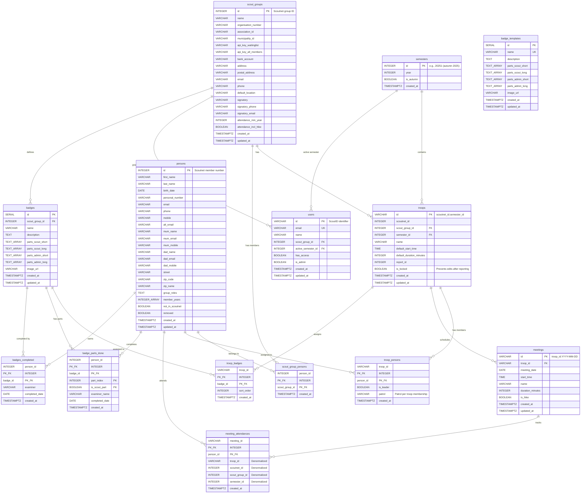

# Database ER Diagram

## Entity Relationship Diagram



## Relationship Summary

### Core Domain

| From | To | Relationship | Description |
|------|-----|--------------|-------------|
| scout_groups | troops | 1:N | A scout group has many troops |
| semesters | troops | 1:N | A semester contains many troops |
| scout_groups | scout_group_persons | 1:N | A scout group has many member assignments |
| persons | scout_group_persons | 1:N | A person can belong to multiple scout groups |
| troops | troop_persons | 1:N | A troop has many member assignments |
| persons | troop_persons | 1:N | A person can be assigned to multiple troops |
| troops | meetings | 1:N | A troop schedules many meetings |
| meetings | meeting_attendances | 1:N | A meeting tracks many attendances |
| persons | meeting_attendances | 1:N | A person can attend many meetings |

### Badge System

| From | To | Relationship | Description |
|------|-----|--------------|-------------|
| scout_groups | badges | 1:N | A scout group defines many badges |
| troops | troop_badges | 1:N | A troop can assign many badges |
| badges | troop_badges | 1:N | A badge can be assigned to many troops |
| persons | badge_parts_done | 1:N | A person completes many badge parts |
| badges | badge_parts_done | 1:N | A badge has many completable parts |
| persons | badges_completed | 1:N | A person earns many badges |
| badges | badges_completed | 1:N | A badge can be completed by many persons |

### User Management

| From | To | Relationship | Description |
|------|-----|--------------|-------------|
| scout_groups | users | 1:N | A scout group grants access to many users |
| semesters | users | 1:N | A semester can be active for many users |

## Key Design Decisions

1. **Deterministic IDs**: Most entities use natural keys (Scoutnet IDs, composite keys) rather than auto-generated UUIDs
2. **Composite Keys**: Junction tables use composite primary keys for efficiency
3. **Soft Deletes**: Persons have a `removed` flag rather than being deleted
4. **Audit Timestamps**: All tables include `created_at`, most include `updated_at`
5. **VARCHAR IDs for Troops/Meetings**: Human-readable composite string keys using '.' separator (e.g., `18309.20251`, `18309.20251.2025-03-15`) to distinguish from date format
6. **Multi-group membership**: `scout_group_persons` junction table allows persons to belong to multiple scout groups
7. **Patrol per troop**: Patrol assignment is stored in `troop_persons`, allowing different patrols in different troops
8. **Troop locking**: `is_locked` flag on troops prevents accidental edits after attendance has been reported
9. **Denormalized attendance**: `meeting_attendances` includes denormalized columns for fast statistics queries

## Index Strategy

```sql
-- Performance indexes
CREATE INDEX idx_scout_group_persons_group ON scout_group_persons(scout_group_id);
CREATE INDEX idx_troops_scout_group_semester ON troops(scout_group_id, semester_id);
CREATE UNIQUE INDEX idx_troops_natural_key ON troops(scoutnet_id, semester_id);
CREATE INDEX idx_troop_persons_person ON troop_persons(person_id);
CREATE INDEX idx_meetings_troop_date ON meetings(troop_id, meeting_date);
CREATE INDEX idx_meeting_attendances_person ON meeting_attendances(person_id);
CREATE INDEX idx_meeting_attendances_semester ON meeting_attendances(semester_id, person_id);
CREATE INDEX idx_meeting_attendances_group ON meeting_attendances(scout_group_id, semester_id);
CREATE INDEX idx_meeting_attendances_troop ON meeting_attendances(troop_id);
CREATE INDEX idx_badges_scout_group ON badges(scout_group_id);
CREATE INDEX idx_badge_parts_done_badge ON badge_parts_done(badge_id);
